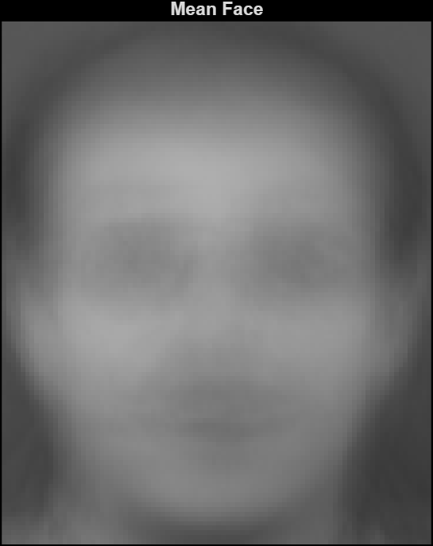
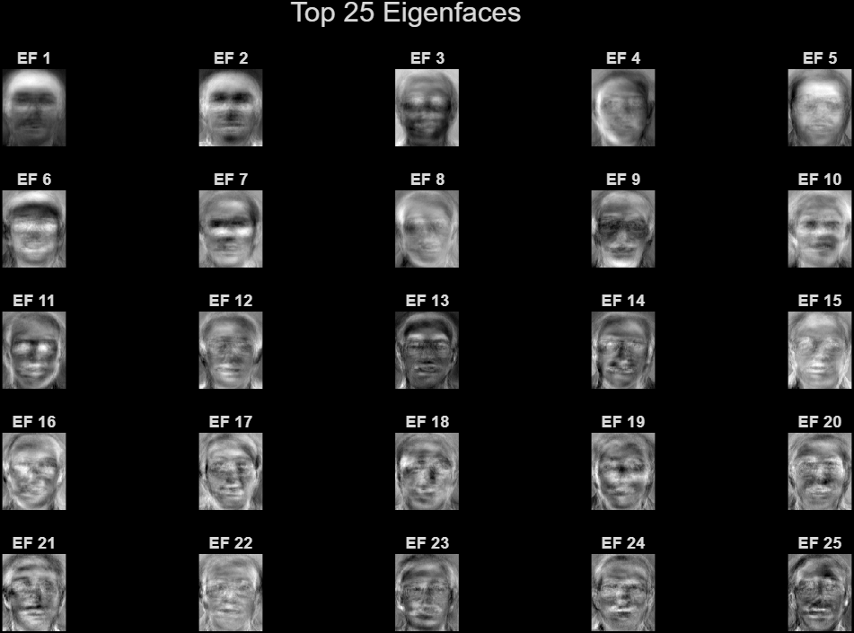
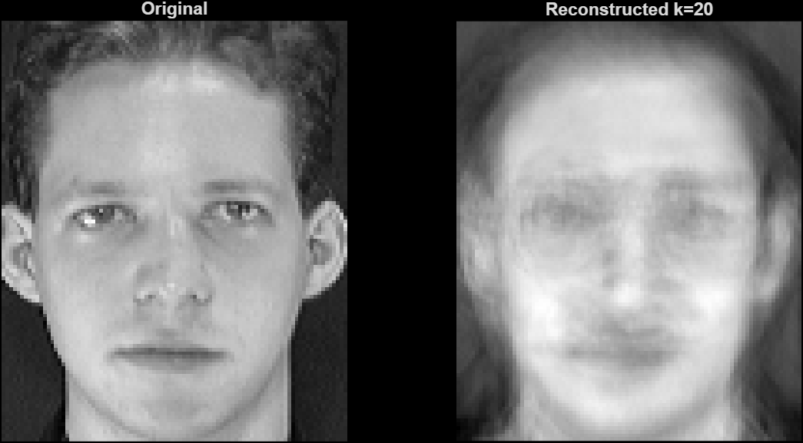

# PCA Face Recognition in MATLAB

This project implements a face recognition system using PCA (Eigenfaces).

## Features
- Mean face computation
- Eigenface visualization
- Face reconstruction
- Recognition accuracy: 93.75%

## Method
1. Convert images to vectors
2. Compute mean face
3. Apply PCA
4. Project faces into eigenspace
5. Compare distances

## Results

### Mean Face

### Eigenfaces

### Reconstruction

## Dataset
ORL Face Dataset (not included due to size/license)
